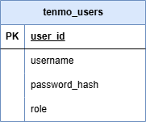

# Module 2 Capstone - TEnmo

Congratulations—you've landed a job with TEnmo, whose product is an online payment service for transferring "TE bucks" between friends. However, they don't have a product yet. You've been tasked with writing a RESTful API server.

## Design Requirements

All applications must include the design assets below.
* A database ERD that includes:
  * All columns, relationships, and constraints for each table
  * Place the database ERD in the `database` folder at the root of the project.
* API endpoint design document which includes a list of all endpoints:
  * List HTTP method and URL
  * Indicate any path variables or query parameters
  * Indicate if the endpoint requires authentication and/or authorization roles
  * Success and error status codes
  * Any JSON request and/or response body schemas (optional, but recommended)
  * Place the API endpoint design document in the `design` folder at the root of this project.
* All other design assets, such as an integration test plan, are optional and should be placed in the `design` folder.

Below is an example of API endpoint design table:

| Endpoint               | Method | Query Parameters                        | Description                   | Success | Error    | Authentication   |
|:-----------------------|:------:|:----------------------------------------|:------------------------------|:-------:|:---------|:-----------------|
| /api/reservations      |  GET   | dateto, optional<br/>datefrom, optional | Get all reservations          |   200   | 400      | None             |
| /api/reservations      |  POST  | None                                    | Create a new reservation      |   201   | 400, 422 | Required         |
| /api/reservations/{id} |  GET   | None                                    | Get a specific reservation    |   200   | 404      | Creator or ADMIN |
| /api/reservations/{id} |  PUT   | None                                    | Update a specific reservation |   200   | 404, 409 | Creator or ADMIN |
| /api/reservations/{id} | DELETE | None                                    | Delete a specific reservation |   204   | 404      | ADMIN            |

### Recommended (Optional)

* Class summaries
    * Instance variables
    * public methods
    * Inheritance or interface relationships
    * Examples:
        * DAO interfaces with method descriptions
        * Model classes
            * DTO @valid checks
        * Service classes
* Flow charts or [Sequence diagrams](https://en.wikipedia.org/wiki/Sequence_diagram)
    * Summarize end-to-end HTTP request to HTTP response for API endpoints
* Database Integration Test Plan
    * Happy Path test cases
    * Corner cases
    * Success criteria
    * Mock users and/or mock test data

## Project Requirements

### Use cases (*[user stories](https://en.wikipedia.org/wiki/User_story)*)

Use cases marked as COMPLETE are already implemented and require no further work.

1. **[COMPLETE]** As a user of the system, I need to be able to register myself with a username and password.
   1. A new registered user starts with an initial balance of 1,000 TE Bucks.
   2. The ability to register has been provided in your starter code.
2. **[COMPLETE]** As a user of the system, I need to be able to log in using my registered username and password.
   1. Logging in returns an Authentication Token. I need to include this token with all my subsequent interactions with the system outside of registering and logging in.
   2. The ability to log in has been provided in your starter code.
3. As an authenticated user of the system, I need to be able to see my Account Balance.
   1. I should not be able to see the balance for any account belonging to another user.
4. As an authenticated user of the system, I need to be able to *send* a transfer of a specific amount of TE Bucks to a registered user.
   1. I should be able to choose from a list of usernames to send TE Bucks to.
   2. I must not be allowed to send money to myself.
   3. A transfer includes the unique User IDs of the from and to users and the amount of TE Bucks.
   4. The receiver's account balance is increased by the amount of the transfer.
   5. The sender's account balance is decreased by the amount of the transfer.
   6. I can't send more TE Bucks than I have in my account.
   7. I can't send a zero or negative amount.
   8. A Sending Transfer has an initial status of *Approved*.
5. As an authenticated user of the system, I need to be able to see transfers I have sent or received.
   1. I should not be able to see transfers between accounts that I do not own.
6. As an authenticated user of the system, I need to be able to retrieve the details of any transfer from an account I own based upon the transfer ID.
7. As an authenticated user of the system, I need to be able to *request* a transfer of a specific amount of TE Bucks from another registered user.
   1. I should be able to choose from a list of usernames to request TE Bucks from.
   2. I must not be allowed to request money from myself.
   3. I can't request a zero or negative amount.
   4. A transfer includes the unique User IDs of the from and to users and the amount of TE Bucks.
   5. A Request Transfer has an initial status of *Pending*.
   6. No account balance changes until the request is approved.
   7. The transfer request should appear in both users' list of transfers (use case #5).
8. As an authenticated user of the system, I need to be able to see my *Pending* transfers.
9. As an authenticated user of the system, I need to be able to either approve or reject a Request Transfer.
   1. I can't "approve" a given Request Transfer for more TE Bucks than I have in my account.
   2. The Request Transfer status is *Approved* if I approve, or *Rejected* if I reject the request.
   3. If the transfer is approved, the requester's account balance is increased by the amount of the request.
   4. If the transfer is approved, the requestee's account balance is decreased by the amount of the request.
   5. If the transfer is rejected, no account balance changes.
10. As an administrator of the system, I can view any pending or approved transactions.
11. As an administrator of the system, I can view the balance of TE bucks from any authenticated user in the system.
12. As an administrator of the system, I can not have an account and can not participate in transactions with other users.
13. As an authenticated user of the system, I can convert between TE bucks and US Dollars (USD) for any amount of TE bucks in my account into a second account.
    1. The second account can only hold USD and **can not** be used in transactions between other authenticated users.
    2. The exchange rate for TE bucks to US Dollars (USD) is the same exchange rate for Euros (EUR) to USD on the day the conversion is made. 
    3. The conversion from TE bucks to USD and vice versa **shall not** be logged as a transaction in the system.

## Exchange rate API

The daily exchange rate for Euros (EUR) to US Dollars (USD) can be retrieved from the free [Frankfurter Exchange Rate REST API](https://frankfurter.dev/)

Documentation: https://frankfurter.dev/  
The base URL for the REST API is: `https://api.frankfurter.dev/v1`

Getting the *EUR to USD* exchange rate example:
```json
// GET /latest?symbols=usd
// JSON Response body for the exchange rate from EUR to USD
{
    "amount": 1.0,
    "base": "EUR",
    "date": "2025-07-04",
    "rates": {
        "USD": 1.1767       // 1 EUR is euqal to 1.1767 USD
    }
}
```

Getting the *USD to EUR* exchange rate example:
```json
// GET /latest?base=usd&symbols=eur
// JSON Response body for the exchange rate from USD to EUR
{
    "amount": 1.0,
    "base": "USD",
    "date": "2025-07-04",
    "rates": {
        "EUR": 0.84983       // 1 USD is euqal to 0.84983 EUR 
    }
}
```

## Database schema

### Database setup

To run the application, you must first create the `tenmo` database. Then run the `database/tenmo.sql` script to create the user table with some test users.

> Note: The script creates two users for testing, `user` and `admin`, which both have the password: `password`.



### Datasource

A Datasource has been configured for you in `src/resources/application.properties`.

```
# datasource connection properties
spring.datasource.url=jdbc:postgresql://localhost:5432/tenmo
spring.datasource.name=tenmo
spring.datasource.username=postgres
spring.datasource.password=postgres1
```

### JdbcTemplate

If you look in `src/main/java/com/techelevator/dao`, you'll see `JdbcUserDao`. This is an example of how to get an instance of `JdbcTemplate` in your DAOs. If you declare a field of type `JdbcTemplate` and add it as an argument to the constructor, Spring automatically injects an instance for you:

```java
@Component
public class JdbcUserDao implements UserDao {

    private JdbcTemplate jdbcTemplate;

    public JdbcUserDao(JdbcTemplate jdbcTemplate) {
        this.jdbcTemplate = jdbcTemplate;
    }
}
```

## Testing


### DAO integration tests

`com.techelevator.dao.BaseDaoTest` has been provided for you to use as a base class for any DAO integration test. It initializes a Datasource for testing and manages rollback of database changes between tests.

`com.techelevator.dao.JdbUserDaoTest` has been provided for you as an example for writing your own DAO integration tests.

Remember that when testing, you're using a copy of the real database. The schema and data for the test database are defined in `src/test/resources/test-data.sql`. The schema in this file matches the schema defined in `database/tenmo.sql`.


## Authentication

The user registration and authentication functionality for the system has already been implemented. If you review the login code, you'll notice that after successful authentication, an instance of `AuthenticatedUser` is stored in the `currentUser` member variable of `App`. The user's authorization token—meaning JWT—can be accessed from `App` as `currentUser.getToken()`.

When the use cases refer to an "authenticated user", this means a request that includes the token as a header. You can also reference other information about the current user by using the `User` object retrieved from `currentUser.getUser()`.

### Running the starter code

Use the code in this project as the starter code for your project.
After setting up the database, run the application from the TenmoApplication class. There should be no errors.

The starter code implements the two user story requirements below:
1. As an unauthenticated user, I need to be able to register myself with a username and password.
2. As an unauthenticated user, I need to be able to log in using my registered username and password.

The API endpoints for these two requirements are in `controller/AuthenticationController.java`:
1. POST `/register`
2. POST `/login`

To test these two endpoints, import the `postman/tenmo_postman_collection.json` into Postman as a collection.
Open the Login and Register requests and test they work.